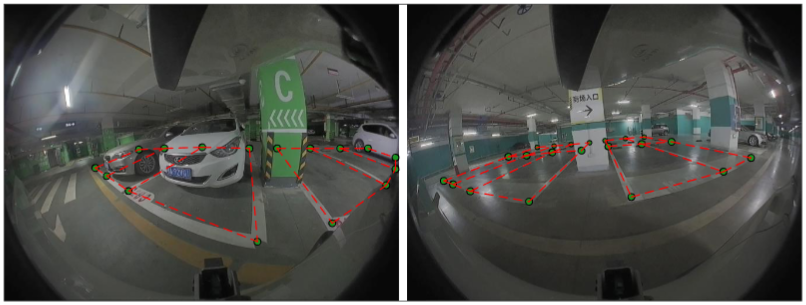

<!--
Hey, thanks for using the awesome-readme-template template.  
If you have any enhancements, then fork this project and create a pull request 
or just open an issue with the label "enhancement".

Don't forget to give this project a star for additional support ;)
Maybe you can mention me or this repo in the acknowledgements too
-->
<div align="center">

<!--    -->
  <h1>A large-scale fisheye dataset for parking slot detection</h1>
  
  <p>
    The benchmark method will be publicly available upon publication! 
  </p>
  
  
<!-- Badges -->
<p>
  <a href="https://github.com/Vipermdl/ParkScape/graphs/contributors">
    
  </a>
  <a href="">
    
  </a>
  <a href="https://github.com/Vipermdl/ParkScape/network/members">
    
  </a>
  <a href="https://github.com/Vipermdl/ParkScape/stargazers">
    
  </a>
  <a href="https://github.com/Vipermdl/ParkScape/issues/">
    
  </a>
<!--   <a href="https://github.com/Vipermdl/ParkScape/blob/master/LICENSE">
    
  </a> -->
</p>
   
<h4>
    <a href="https://github.com/Vipermdl/ParkScape">View Demo</a>
  <span> · </span>
    <a href="https://github.com/Vipermdl/ParkScape">Documentation</a>
  <span> · </span>
    <a href="https://github.com/Vipermdl/ParkScape/issues/">Report Bug</a>
  <span> · </span>
    <a href="https://github.com/Vipermdl/ParkScape/issues/">Request Feature</a>
  </h4>
</div>

<br />

<!-- Table of Contents -->
# :notebook_with_decorative_cover: Table of Contents

- [About the Project](#star2-about-the-project)
  * [Model architecture](#camera-model-architecture)
  * [Contributions](#dart-contributions)
- [Getting Started](#toolbox-getting-started)
  * [Prerequisites](#bangbang-prerequisites)
  * [Installation](#gear-installation)
- [Data preparation](#compass-data-preparation)
  * [Dissolved Oxygen measurements](#art-dissolved-oxyen-measurements)
  * [Driven factors](#key-driven-factors)
- [Develop the Oxyformer](#eyes-develop-the-oxyformer)
  * [Training Oxyformer](#test_tube-training-oxyformer)
  * [Run inference](#running-run-inference)
  * [Post process](#triangular_flag_on_post-post-process)
 - [Data and Results](#scroll-data-and-results)
- [Contributing](#wave-contributing)
- [License](#warning-license)
- [Contact](#handshake-contact)
- [Acknowledgements](#gem-acknowledgements)

<!-- About the Project -->
## :star2: About the Project

<div style="color:#0000FF" align="center">
 
</div>

Autonomous valet parking systems eliminae the need for human drivers to find parking slots, reducing the hassle associated with parking in congested areas. Fisheye imags provise valuable information over a large area instantaneously; nevertheless, no current dataset captures the complexity of parking scenes at the level of granularity required by real-world applications. To address this, we introduce ParkScapes, an fisheye image dataset with highly-accurate, fine-grained annotation for corner-based parking slot labeling. ParkScape provides annotation for 10,000 images, covering a variety of diverse scanarios, including shopping malls, industrial parks, and communities. Please cite if you use it in your work!

### :fire: Update

- [2024/03/04] We have released the ParkScape, you can download the dataset from [here](https://github.com/Vipermdl/Oxyformer/blob/main/data.md).

<!-- Getting Started -->
## 	:toolbox: Getting Started

<!-- Prerequisites -->
### :bangbang: Prerequisites

* Python 3.8
* Pytorch 1.11.0
* CUDA 11.3 or higher

<!-- Installation -->
### :gear: Installation

First, install dependencies

```bash
  # clone project 
  git clone https://github.com/Vipermdl/ParkScape
  
  # install project
  cd ParkScape
  pip install -r requirements.txt
```

<!-- Roadmap -->
## :compass: Checkpoints

To run the evaluation process, you need to download the model weights

```bash
wget -q https://github.com/Vipermdl/releases/download/v0.1.0-alpha/parkscape_detector.pth
```

### :art: Inference with detect.py

```bash
python detect.py --weights parkscape_detector.pth --source 0                               # webcam
                                                     img.jpg                         # image
                                                     vid.mp4                         # video
                                                     screen                          # screenshot
                                                     path/                           # directory
                                                     list.txt                        # list of images
                                                     list.streams                    # list of streams
                                                     'path/*.jpg'                    # glob
                                                     'https://youtu.be/LNwODJXcvt4'  # YouTube
                                                     'rtsp://example.com/media.mp4'  # RTSP, RTMP, HTTP stream
```

### :key: Training

After the model and dataset download automatically, training time for the parking slot detector are 2 days on a NVIDIA 3090 GPU (Multi-GPU times faster). Use the largest `--batch-size` possible, or pass `--batch-size -1` for detector [AutoBatch](https://github.com/ultralytics/yolov5/pull/5092).

```bash
python train.py --data parkscape.yaml --epochs 300  --cfg parking_slot_detector.yaml  --batch-size 16                                                              
```

<!-- Code of Conduct -->
## :scroll: Results

| Name                                                                                |Date accessed|
| ----------------------------------------------------------------------------------- |------ |
| [World Ocean Database](https://www.ncei.noaa.gov/)|02-2023|
| [CLIVAR and Carbon Hydrographic Database](https://cchdo.ucsd.edu/)|02-2023|
| [Pangaea Database](https://www.pangaea.de/)|02-2023|
| [Global Ocean Data Analysis](https://www.ncei.noaa.gov/access/ocean-carbon-acidification-data-system/oceans/GLODAPv2_2021/)|02-2023|

## :wave: Contributing

<a href="https://github.com/Vipermdl/ParkScape/graphs/contributors">
  
</a>

Contributions are always welcome!

<!-- FAQ -->
<!-- ## :grey_question: FAQ

- Question 1

  + Answer 1

- Question 2

  + Answer 2 -->


<!-- License -->
## :warning: License

Distributed under the no License. See LICENSE.txt for more information.


<!-- Contact -->
## :handshake: Contact

Dongliang Ma - [@dongliangma1](https://twitter.com/dongliangma1) - mdl.viper@gmail.com

Project Link: [https://github.com/Vipermdl/ParkScape](https://github.com/Vipermdl/ParkScape)


<!-- Acknowledgments -->
## :gem: Acknowledgements

Use this section to mention useful resources and libraries that you have used in your projects.

 - [Xarray](https://docs.xarray.dev/en/stable/)
 - [Cartopy](https://scitools.org.uk/cartopy/docs/latest/)
 - [GEBCO_2022](https://www.gebco.net/data_and_products/gridded_bathymetry_data/gebco_2022/)
